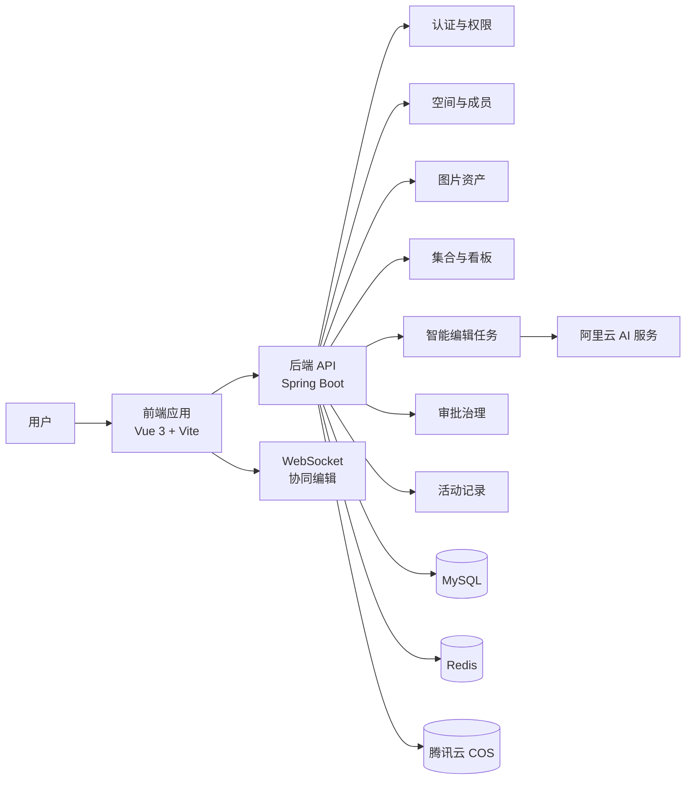

# Tuyu 图片协作平台

Tuyu 是一个面向图片资产管理、团队协作、集合编排、智能编辑和内容审批的全栈项目。项目采用前后端分离架构，前端负责工作台体验和图片操作流程，后端提供用户、空间、图片、集合、AI 任务、审批治理等核心服务。

## 项目架构



## 目录结构

```text
Tuyu/
  qiu-picture-frontend/   # 前端工程，Vue 3 + Vite
  qiu-picture-backend/    # 后端工程，Spring Boot
```

## 功能模块

- 用户体系：注册、登录、用户信息管理、管理员管理。
- 图片管理：图片上传、URL 上传、图片列表、图片详情、搜索、编辑、批量处理。
- 空间管理：个人空间、团队空间、空间成员、空间权限、容量和用量分析。
- 资产工作台：统一管理图片资产、版本信息、生命周期状态和元数据。
- 集合与看板：创建集合、添加资产、分组展示、拖拽排序和集合看板。
- 智能编辑：AI 扩图任务、任务队列、结果预览、结果应用。
- 协同编辑：基于 WebSocket 的图片编辑状态同步。
- 审批治理：发布审批、审批收件箱、审批决策、治理策略配置。
- 活动记录：记录空间内的图片、集合、审批等关键操作动态。
- 数据分析：空间用量、分类、标签、大小、用户贡献和排行榜分析。

## 技术选型

### 前端

- Vue 3：前端 UI 框架。
- Vite：开发服务器和构建工具。
- TypeScript：类型约束和工程化开发。
- Pinia：前端状态管理。
- Vue Router：路由管理。
- Ant Design Vue：基础组件库。
- Tailwind CSS：页面样式和工作台视觉优化。
- Axios：接口请求封装。

### 后端

- Spring Boot：后端应用框架。
- MyBatis-Plus：数据访问和基础 CRUD。
- MySQL：核心业务数据存储。
- Redis：会话、缓存和协同状态辅助。
- Sa-Token：登录认证和权限控制。
- WebSocket：图片协同编辑通信。
- 腾讯云 COS：图片对象存储。
- 阿里云 AI：智能扩图等 AI 图片处理能力。
- Knife4j：接口文档。
- JUnit 5 / Mockito：单元测试。

## 本地启动

### 后端

进入后端目录：

```bash
cd qiu-picture-backend
```

准备本地配置：

```bash
cp src/main/resources/application-local.yml.example src/main/resources/application-local.yml
```

在 `application-local.yml` 中填写本地 COS、AI 等配置。生产环境配置应通过环境变量注入，不要提交真实密钥。

启动服务：

```bash
mvn spring-boot:run
```

默认接口地址：

```text
http://localhost:8123/api
```

### 前端

进入前端目录：

```bash
cd qiu-picture-frontend
```

安装依赖：

```bash
npm install
```

准备开发环境配置：

```bash
cp .env.development.example .env.development
```

启动开发服务器：

```bash
npm run dev
```

## 配置与安全说明

- 不要提交真实数据库密码、Redis 密码、COS SecretId、COS SecretKey、AI API Key。
- 本地配置文件应使用 `application-local.yml`、`application-prod.yml`、`.env.development` 等被忽略的文件。
- 仓库中只保留 `.example` 示例配置和环境变量占位。
- 如果密钥曾经被公开提交，应立即到对应云平台轮换密钥，并清理 Git 历史。

## 开发状态

当前项目包含完整的前后端基础能力和多阶段工作台功能，适合作为图片资产管理、团队素材协作和智能图片处理平台的基础版本继续迭代。
